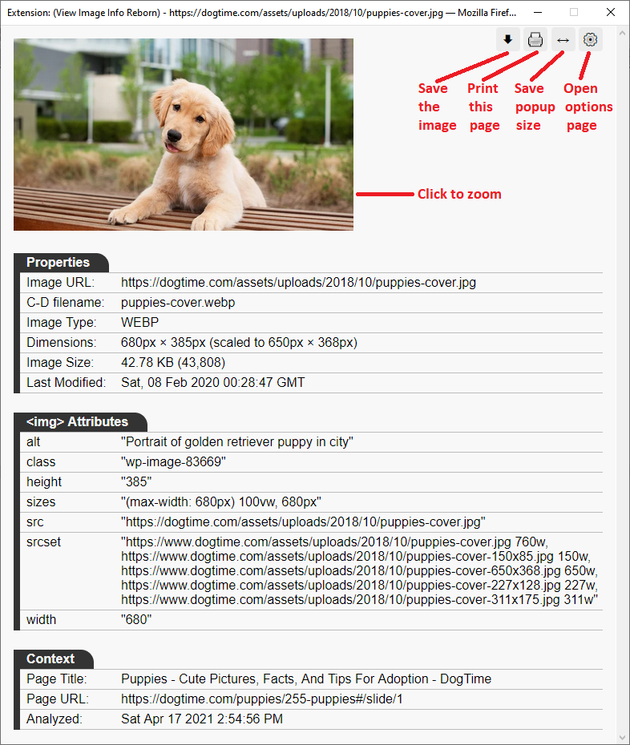
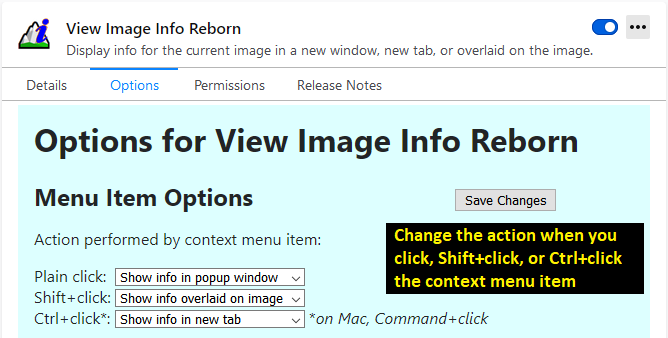
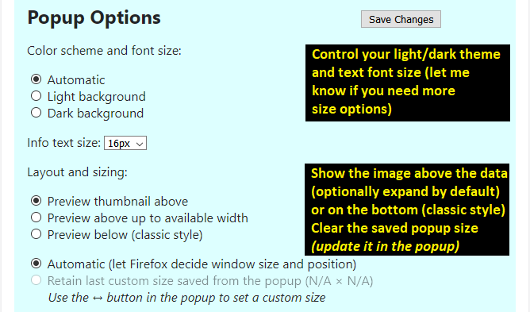

# View Image Info Reborn -- Firefox extension

Many users are missing the convenience of View Image Info on the right-click context menu. This is an attempt to restore and expand on that feature. Basic bugs have been solved, but there are new things to add.

https://addons.mozilla.org/firefox/addon/view-image-info-reborn/ 

## Screenshots (version 1.8)

Context menu can display the information in different ways. Use the Options page to change what click, Shift+Click and Ctrl+click (Mac: Command+Click) do.

By default, you get a new window with the usual details.

If you choose to overlay the information onto the image, the details are more compact.

The overlay also is available for stand-alone images (images you open into the same or a new tab).

Click the gear icon on the info page, or access Options through the Add-ons page to adjust menu actions, color scheme, and font size.

